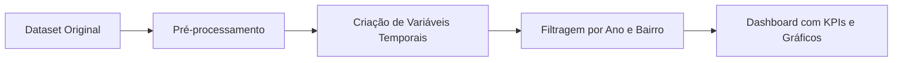

# Análise de Acidentes Graves em Nova York (NYC)

Este projeto tem como objetivo analisar acidentes de trânsito com gravidade elevada na cidade de Nova York, com foco em identificar padrões críticos por local, horário e severidade. A solução combina análise exploratória e visualizações interativas para apoiar decisões de segurança pública, como alocação de radares, policiamento e políticas de prevenção.

## Objetivo

Gerar insights confiáveis e acionáveis sobre os acidentes graves em NYC a partir de dados públicos. Com base nos resultados, pretende-se oferecer recomendações estratégicas para reduzir feridos e mortos no trânsito, tornando o ambiente urbano mais seguro.

---

## 1. Análise Exploratória e Insights

Foi realizada uma análise aprofundada utilizando dados de acidentes entre 2020 e 2022, com as seguintes abordagens:

- Conversão correta da data e hora (`CRASH_DATETIME`)
- Criação de variáveis temporais: hora, dia da semana, mês e ano
- Identificação dos 5 bairros com maior número de acidentes
- Segmentação por gravidade dos acidentes (`IS_SEVERE`)
- Detecção de padrões críticos por hora e dia

**Principais descobertas:**

- Os bairros **Brooklyn**, **Queens**, **Manhattan**, **Bronx** e **Staten Island** concentram a maioria dos acidentes.
- Os horários com mais ocorrências estão entre **16h e 19h**, coincidindo com o pico do trânsito.
- Os dias de **sexta-feira** e **segunda-feira** se destacam como os mais críticos.
- A pandemia impactou o volume de acidentes, especialmente em 2020.

---

## 2. Painel Interativo

Um dashboard foi desenvolvido com `Dash` para visualização dos principais padrões.



### Funcionalidades do dashboard:

- Filtros por **ano** e **bairro**
- KPIs dinâmicos: número de acidentes, feridos, mortos e percentual de casos graves
- Gráficos interativos:
  - Acidentes por hora do dia
  - Acidentes por dia da semana
  - Mapa com localização geográfica das ocorrências

---

## 3. Tecnologias Utilizadas

- pandas  
- numpy  
- plotly  
- dash  
- dash-bootstrap-components  

---

## 4. Execução

Para rodar o projeto localmente:

```bash
pip install -r requirements.txt
```

No Jupyter Notebook ou Colab, execute o arquivo `Analise_acidentes_graves.ipynb`. O dashboard é iniciado com:

```python
app.run(mode='inline', debug=True)
```

---

## 5. Conclusão

Este projeto mostra como dados públicos podem ser transformados em **informação estratégica** para segurança urbana. Os insights são claros e prontos para uso por órgãos públicos, prefeituras, e iniciativas de cidades inteligentes.

Além disso, o projeto serve como **demonstração sólida de habilidades em análise de dados, visualização e storytelling com Dash**, sendo ideal para inclusão em portfólios profissionais.

---

## Autor

**Heitor Tonet**  
Engenheiro de Controle e Automação e Cientista de Dados, com foco em manutenção preditiva, análise de falhas e inteligência aplicada à indústria e cidades inteligentes.

---

## Licença

MIT License